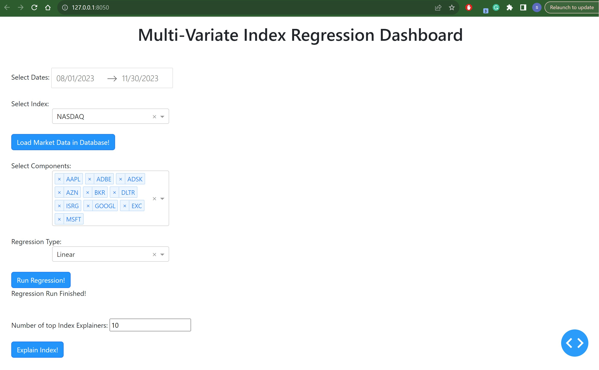
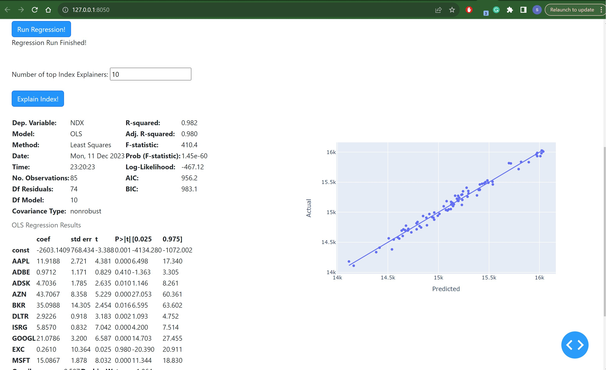
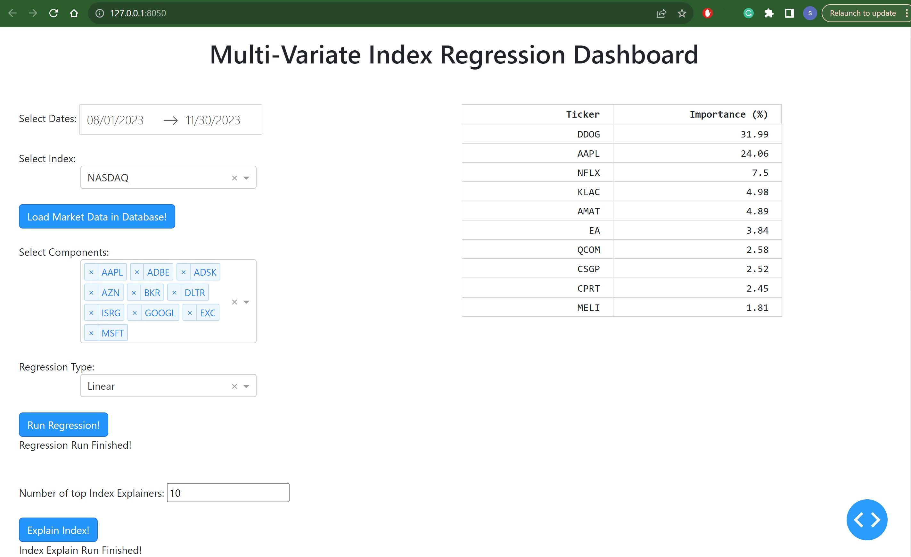
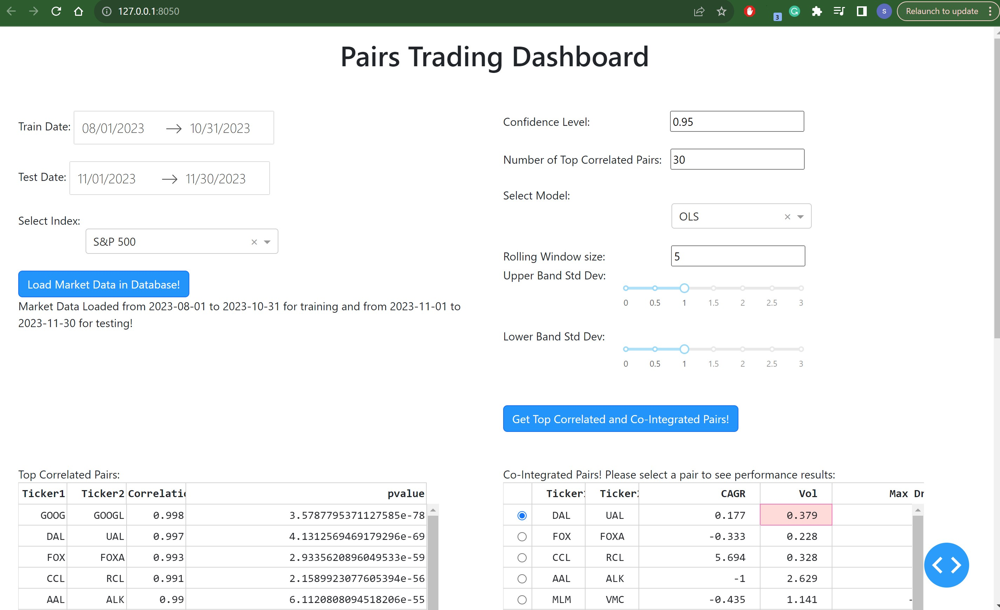
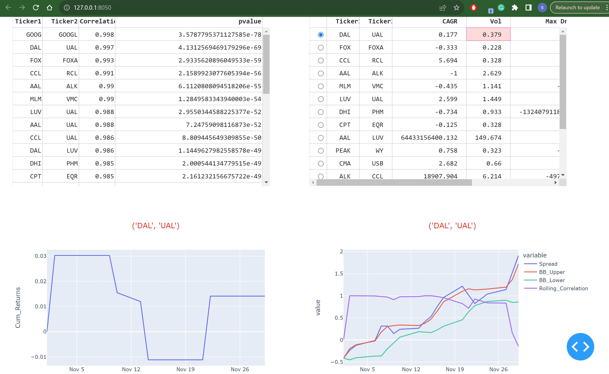
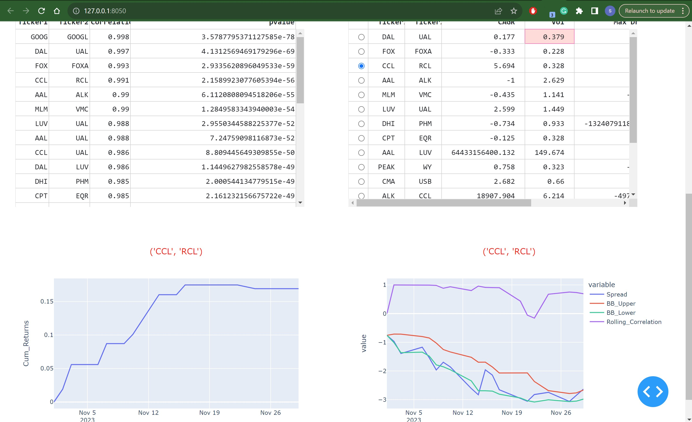

# Pairs Trading and Multi-Variate Index Regression Dashboards
Projects to implement Dash Apps for Pairs Trading and Index Regression interactive Dashboards. 
- **Pairs Trading dashboard** lets the user select train/test periods, index, confidence level, rolling window size, Bollinger Band Standard Deviations, etc. to run and backtest pairs trading strategy. Results are displayed as tables and the user can select a table row to see the timeseries performance graphs of the pair.  
- **Multi-Variate Regression Dashboard** lets the user select the index and its components to run multi-variate regression between them. Various types of regression: linear, Lasso, and Ridge are supported. The Dashboard also lets the user to see the index's top components which explains the index the best. Index explain is implemented using RandomForest feature importance.

## Screenshots

### Multi-Variate Regression Dashboard

### Pairs Trading Dashboard

## Installations

### Python
Anaconda environment is used to develop the Apps. The environment file env.yml has been provided to create the Anaconda environment using below command:  
conda env create -f env.yml

### MongoDB
The community edition of MongoDB has been used in the backend to store data.  
https://www.mongodb.com/docs/manual/administration/install-community/
It's assumed that the MongoDB service is running on the user's computer.
### GUI
Dash framework has been used to develop the Dashboards.

## Running the Dashboard Apps
- **Pairs Trading**: Run pairs_trading_gui.py file. It shall show in python shell: Dash is running on http://127.0.0.1:8050/ . Click on the URL to launch the dashboard.
- **Multi-Variate Index Regression**: Run index_regression_gui.py file. It shall show in python shell: Dash is running on http://127.0.0.1:8050/ . Click on the URL to launch the dashboard.

## Code directory structure
- trading_dashboards:
  - database:
      - database_wrapper.py: Wrapper on Mongo db APIs for database create, read, write, etc. operations.
      - source.py: Interface to read data from different types of sources registered to the interface.
      - data_loader.py: Module for reading data from different sources and write to the database.
  - config.py: Config file for the dashboards.
  - env.yml: Anaconda environment file.
  - index_regression_gui.py: Implementing Dash App for Multi-Variate Index Regression and Index Explain.
  - pairs_trading.py: Module implementing Pairs Trading Strategy and backtesting.
  - pairs_trading_gui.py: Dash App implementing Pairs Trading Dashboard GUI.
  - utils.py: Utility functions for the dashboards.
  - rut_components.csv: CVS file containing Russell 2000 components.
